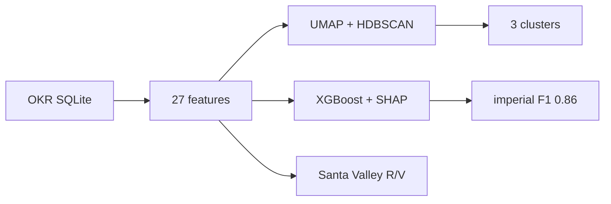

# Khipu-ml

Machine learning on Inka khipus — knotted-cord records of the Inka state that remain undeciphered.

[](https://arxiv.org/abs/2607.00185)
[](LICENSE)
[](https://www.python.org/)
[](https://www.kaggle.com/code/macmaky/khipu-ml)

Maria Contreras (UPC, Lima) · paper [arXiv:2607.00185](https://arxiv.org/abs/2607.00185) · data [Open Khipu Repository](https://doi.org/10.5281/zenodo.18025748)

The pipeline turns the public OKR (619 khipus, 54,403 cords, 110,677 knots) into 27 structural features per specimen, then clusters, classifies provenance, and replicates a published Santa Valley finding — without touching the objects.

| | |
|---|---|
| Corpus | **619** khipus · **27** features |
| Clusters | **3** groups, silhouette **0.769** |
| Imperial style | XGBoost F1 **0.86** (Inka Late Horizon) |
| Santa Valley | Recto/verso moiety **reproduced** from OKR alone |

## What it finds

**Imperial khipus are a tight cluster.** 17 Late Horizon specimens sit apart from the rest of the corpus. SHAP ranks cord twist, short uniform length, high knot density, and a restricted color palette as the signature of centralized manufacture. S-twist dominates imperial cords (85.3%).

**One cluster is colonial collecting, not a region.** Cluster 2 (160 khipus) is dominated by 19th-century European and North American museums. Twist-ratio vs the Central Coast majority differs at *p* ≈ 3.7×10⁻²⁷⁶, much of it unrecorded twist coded `U`. The OKR is not a neutral sample of Inka khipus.

**Santa Valley moiety structure holds in the public database.** Medrano and Urton (2018) argued that attachment direction (recto/verso) encodes hanan/hurin. From OKR `ATTACHMENT_TYPE` only, five of six Santa Valley khipus (KH0323–KH0328) are pure R or pure V; **KH0326 is the only mixed specimen** — the same khipu the original study flagged. Aggregate R/V is 49%/51% vs their ~47%/53%. This is the structural claim, not the 367-peso tribute total.

| OKR | Recto | Verso |
|---|---:|---:|
| KH0323 | 310 | 0 |
| KH0324 | 0 | 54 |
| KH0325 | 0 | 207 |
| KH0326 | 40 | 69 |
| KH0327 | 0 | 93 |
| KH0328 | 56 | 0 |

Coastal classes confuse each other (weighted F1 0.46 on 135 labeled specimens). Knot-type n-grams add nothing (ΔF1 ≈ −0.006).



## Run it

```bash
git clone https://github.com/mcontrerasmalpar-pixel/khipu-ml.git
cd khipu-ml
python -m venv .venv && source .venv/bin/activate
pip install -r requirements.txt
```

Download [`khipu.db`](https://doi.org/10.5281/zenodo.18025748) into `data/`, then open `notebooks/01_pipeline_khipu.ipynb` (same notebook on [Kaggle](https://www.kaggle.com/code/macmaky/khipu-ml)).

```
data/          khipu.db (gitignored)
notebooks/     full pipeline
src/           loader, features, utils
outputs/       figures (gitignored)
```

## Cite

```bibtex
@misc{contreras2026khipu,
  title={Structural Pattern Mining in Inka Khipus: Unsupervised Clustering, Provenance Classification, and a Computational Validation of the Santa Valley Match},
  author={Contreras, Maria},
  year={2026},
  eprint={2607.00185},
  archivePrefix={arXiv},
  primaryClass={cs.CL},
  url={https://arxiv.org/abs/2607.00185}
}
```

```bibtex
@dataset{open_khipu_repository,
  title = {Open Khipu Repository},
  doi   = {10.5281/zenodo.18025748},
  url   = {https://doi.org/10.5281/zenodo.18025748}
}
```
